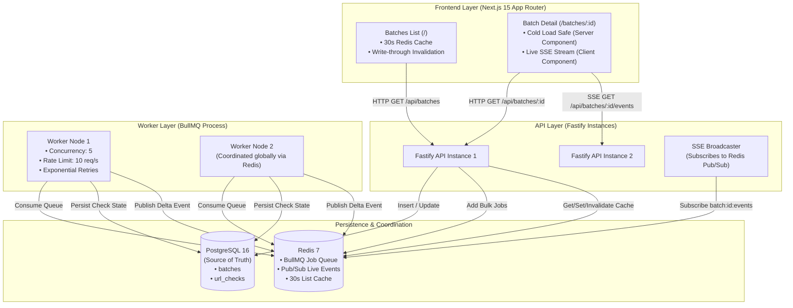
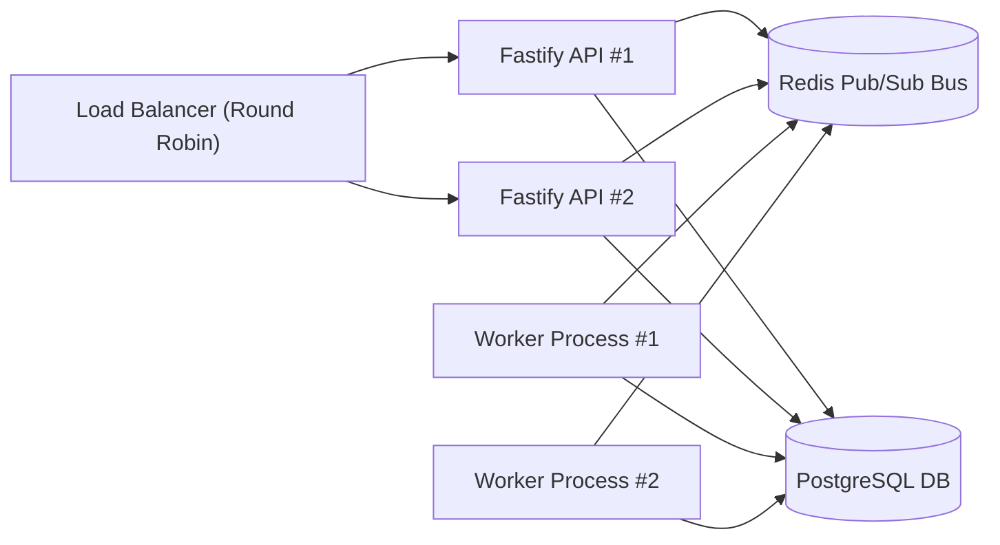

# ProbePulse — Distributed Bulk URL Health Checker

A production-grade, distributed, high-concurrency URL health checking system built with **Fastify, BullMQ, Redis, PostgreSQL, Next.js 15 (App Router), and TypeScript**.

---

## ⚡ Quick Start (One-Command Launch)

To run the entire system (PostgreSQL, Redis, Fastify API, BullMQ Worker, and Next.js Web App) with a single command:

```bash
docker compose up --build
```

- **Frontend Dashboard**: [http://localhost:3000](http://localhost:3000)
- **Fastify API Server**: [http://localhost:4000](http://localhost:4000)
- **Interactive Swagger / OpenAPI UI**: [http://localhost:4000/docs](http://localhost:4000/docs)
- **PostgreSQL Database**: `localhost:5433` (Internal: `5432`)
- **Redis & BullMQ**: `localhost:6380` (Internal: `6379`)

---

## 🛠️ Local Development (Without Docker Compose)

```bash
# 1. Start Database & Redis background containers
docker compose up -d postgres redis

# 2. Install workspace dependencies
npm install

# 3. Start API, Worker, and Web concurrently
npm run dev
```

---

## 🏗️ Architecture Overview



---

## 🏛️ Infrastructure Choices & What Breaks Without Them

| Infrastructure Piece | Purpose in Architecture | What Breaks Without It |
| :--- | :--- | :--- |
| **PostgreSQL 16** | **Single Source of Truth** for batches, URLs, HTTP status codes, latency, page titles, and timestamps. | Without Postgres, state is ephemeral. System crashes lose historical data, and concurrent workers cannot reliably coordinate transactional updates. |
| **Redis 7** | Shared coordinator for **BullMQ**, distributed rate limiter token bucket, Pub/Sub event bus, and 30s list cache. | Without Redis, global rate limiting (10 req/s) across multiple worker processes would drift into uncoordinated local limits, and multi-instance APIs couldn't broadcast live events. |
| **BullMQ** | Manages job persistence, 5-check concurrency, distributed 10 req/s rate limiting, and exponential backoff retry scheduling. | Without BullMQ, custom queueing logic would lack Redis-backed atomic locking, resulting in thundering herd problems, lost jobs during restarts, and broken retry state. |
| **Fastify API Server** | Lightweight, high-throughput REST and Server-Sent Events (SSE) server. | Fastify provides low overhead, robust schema validation, and native stream support for SSE. |
| **Next.js 15 App Router** | Hybrid architecture: Server Components for cold-loading direct batch URLs + Client streaming for live progress. | Ensures direct links (`/batches/[id]`) render immediately with 0 client JS, before establishing live SSE connections. |

---

## 🔄 Live Update Transport Choice & Defense

**Choice: Server-Sent Events (SSE) + Redis Pub/Sub**

### Why SSE over WebSockets?
1. **Unidirectional Efficiency**: URL health check updates are purely server-to-client broadcasts. SSE operates directly over HTTP/1.1 or HTTP/2 without requiring a stateful protocol upgrade handshake.
2. **Native Reconnection**: Browser `EventSource` has built-in exponential reconnect logic with automatic reconnection and initial state sync.
3. **Horizontal Scalability with Redis Pub/Sub**: When an API layer is scaled to $N$ instances behind an ALB/Nginx proxy, workers publish check completions to Redis Pub/Sub (`batch:${batchId}:events`). All API nodes receive the events and push them to their respective connected clients seamlessly.
4. **Firewall & Proxy Friendly**: Works seamlessly through enterprise HTTP proxies, load balancers, and CDN edges without WebSocket connection drops or special upgrade headers.

---

## 🛡️ Concurrency, Rate Limiting, Idempotency & Retries

### 1. Global Rate Limit (10 req/second)
- BullMQ's Redis-backed token bucket limiter (`limiter: { max: 10, duration: 1000 }`) enforces a **system-wide ceiling of 10 requests per second** across the entire cluster, regardless of how many worker processes are running.

### 2. Concurrency (5 In Flight)
- The worker executes checks with a concurrency of 5, ensuring network sockets and CPU resources are managed predictably.

### 3. Smart Exponential Backoff Retry Strategy
- **Transient Failures (5xx HTTP status codes, 429, timeouts, ECONNRESET, DNS hiccups)**:
  - Automatically retried up to **3 times** with exponential backoff:
    $$\text{Delay} = 1000 \times 2^{(\text{attempt} - 1)} \quad (1s, 2s, 4s)$$
- **Permanent Failures (400, 401, 403, 404, 405, 410, invalid URL syntax)**:
  - Recorded as completed `FAILED` checks on the very first attempt without wasting retry quota.

### 4. Idempotency & Cancellation State Machine
- Batch creation and URL checks are persisted in PostgreSQL before jobs are enqueued into BullMQ.
- Each BullMQ job is identified deterministically by its unique check UUID (`check-${checkId}`).
- When a batch is cancelled, Redis key `batch:${batchId}:cancelled` is set. Workers check this flag before executing and before persisting to ensure cancelled jobs do not overwrite user intent.

---

## ⚡ 30-Second Caching Strategy & Freshness Guarantee

- `GET /api/batches` is cached in Redis with a **30-second TTL** (`cache:batches:list`).
- **Write-Through / Proactive Invalidation**: Whenever a batch is created, changes state, completes, gets cancelled, or is retried, the API and worker immediately evict the cache key (`redis.del('cache:batches:list')`), guaranteeing cached data never appears stale in the UI.

---

## 🌐 Horizontal Scaling Behavior



- **API Layer**: Completely stateless. Adding more API instances increases HTTP throughput. Clients connecting to any API node receive real-time SSE updates because event routing is decoupled via Redis Pub/Sub.
- **Worker Layer**: Adding worker instances automatically distributes BullMQ jobs while **strictly preserving the 10 req/s global rate limit** because rate limit tokens are stored in Redis.
- **Database Layer**: Uses PostgreSQL connection pooling (`pg.Pool`) with parameterized queries and indexes on `batches(created_at)` and `url_checks(batch_id, status)`.

---

## ⚖️ Trade-offs & Future Enhancements

1. **Trade-off: Server-Sent Events vs WebSockets**
   - *Why SSE*: Simpler, HTTP/2 native, built-in reconnection.
   - *Future*: If two-way messaging (e.g. client pause/resume commands over stream) is needed, WebSockets with Redis adapter could be added.
2. **Trade-off: HTML Title Extraction via Cheerio**
   - *Why Cheerio*: Fast, lightweight, avoids overhead of headless browsers.
   - *Future*: For Single Page Applications (SPAs) rendering titles via client JavaScript, an optional Puppeteer/Playwright headless renderer could be used for deeper audits.
3. **Trade-off: In-Memory Redis Caching**
   - *Why Redis*: Fast sub-millisecond retrieval with atomic eviction.
   - *Future*: Edge caching via Cloudflare Workers / Next.js ISR with cache-tag invalidation.
